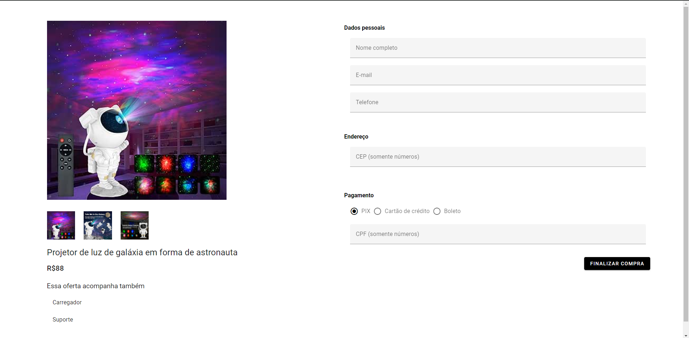

# Deep Space Store

This project consists of creating a payment page for the fictional online store "Deep Space Store". The payment page is the final point where customers can finalize their purchases, viewing a product offer and filling in their details to make payment.




## Table of contents

- [Deep Space Store](#deep-space-store)
	- [Table of contents](#table-of-contents)
	- [Features](#features)
	- [Requirements](#requirements)
	- [Installation](#installation)
	- [Usage](#usage)
		- [Starting the Development Server](#starting-the-development-server)
		- [Building for Production](#building-for-production)
		- [Running Unit tests](#running-unit-tests)
		- [Runinng E2E tests](#runinng-e2e-tests)
	- [License](#license)

## Features

- View a product offer.
- Filling in customer data, including name, email, telephone, address and CPF.
- Providing payment method details such as credit card number, expiration date and security code.
- Validation of data provided by the customer.
- Payment processing.

## Requirements

- [Node.js](https://nodejs.org/en/) >= 20.9.0
- [pnpm](https://pnpm.js.org/) >= 8.10.2

## Installation

Set up the project using pnpm. Use the command
`pnpm install`

After completing the installation, the environment is ready for development.

## Usage

This section covers how to start the development server and build the project for production.

### Starting the Development Server

To start the development server with hot-reload, run the following command. The server will be accessible at [http://localhost:3000](http://localhost:3000):

```bash
pnpm dev
```

Note that in the '/' route there will be nothing shown on the screen, it is necessary to include an offer code in the url.
Use code "1" to view the offer page and form. Example: `http://localhost/1`

### Building for Production

To build your project for production, use:

```bash
pnpm build
```

Once the build process is completed, the application will be ready for deployment in a production environment.

### Running Unit tests

To run unit tests, run the the following command:

```bash
pnpm test
```

Unit test files are in the folder `src/__tests__`

Coverage files will be in the folder `/coverage`

### Runinng E2E tests

To open Cypress UI, run the the following command:

```bash
pnpm cypress:open
```
Then select the spec file to run the test.

E2E test files are in the folder `/cypress/e2e`

## License

[MIT](http://opensource.org/licenses/MIT)
